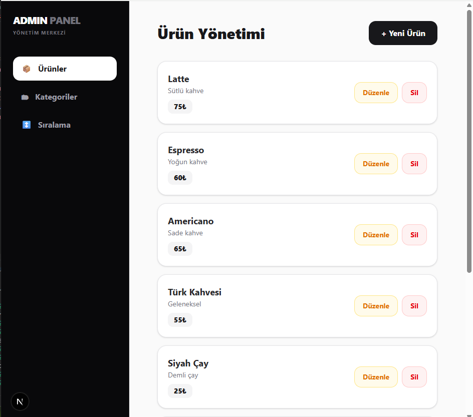
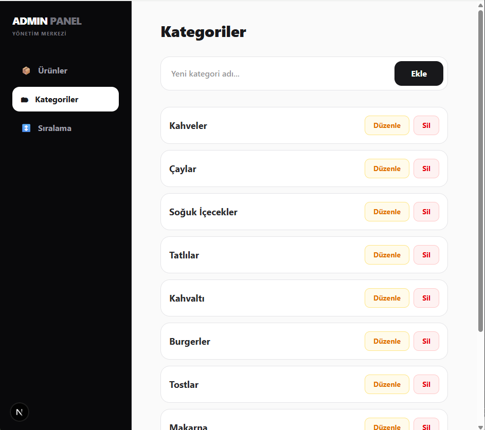
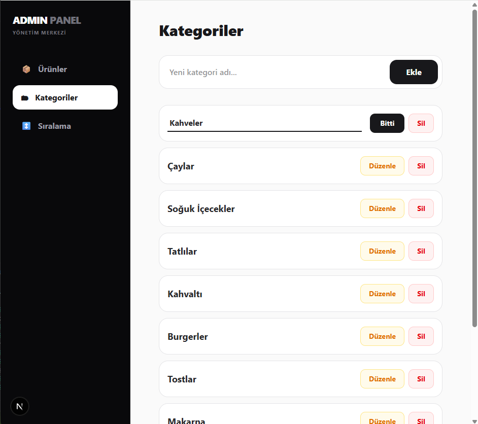
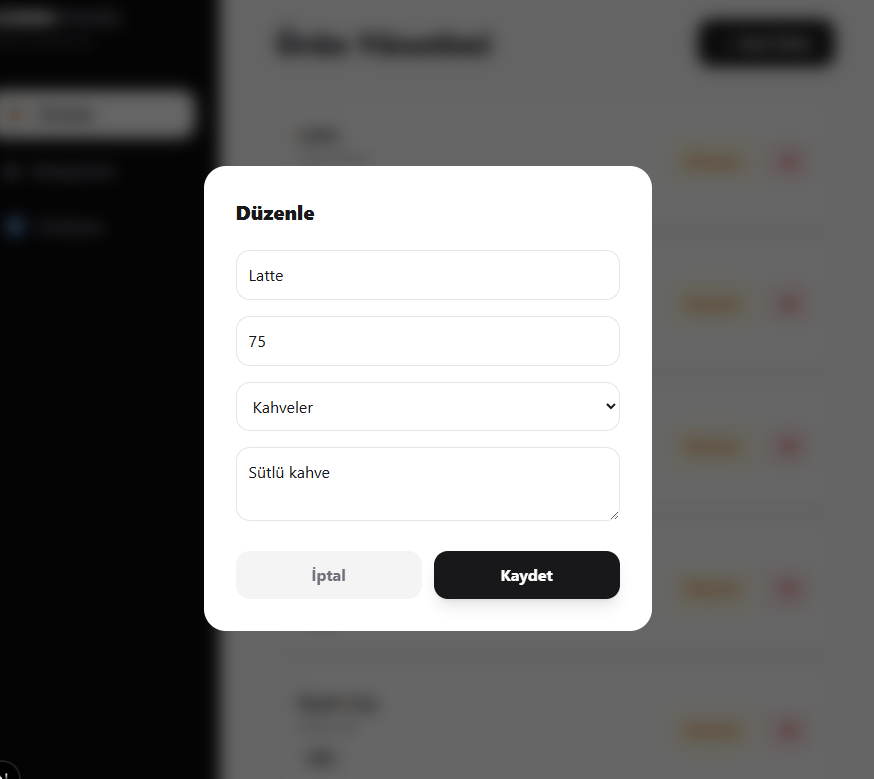
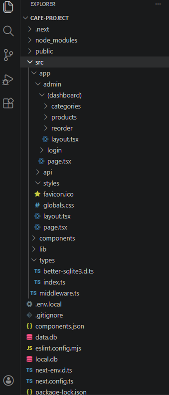

### QR Menu & Management System (Next.js 15)

### 🧩 Proje Hakkında

Modern restoran ve kafe ihtiyaçları için geliştirilmiş, Next.js 15 ve SQLite tabanlı bir dijital menü yönetim sistemidir. Hem müşteri tarafı için iştah açıcı bir arayüz hem de işletme sahibi için kapsamlı bir yönetim paneli sunar.
   
   
### Bu proje, modern web teknolojileri ve Full-Stack mimari yaklaşımıyla geliştirilmiş olup aşağıdaki katmanları içerir:
   
🖥️ Presentation Layer (App Router) → Next.js 15 tabanlı duyarlı (responsive) kullanıcı arayüzü    
⚙️ API Layer (Route Handlers) → Backend servisleri ve veri işleme    
🗄️ Data Access Layer (Better-SQLite3) → Yerel veritabanı yönetimi    
🔐 Security Layer (Middleware) → Cookie tabanlı kimlik doğrulama ve rota koruması    

### Uygulama, gerçek zamanlı menü yönetimi, dinamik ürün sıralama ve kategori bazlı organizasyon gibi kurumsal işlevleri destekler.

## 📬 İletişim
Bu proje, modern web mimarisi, Full-Stack geliştirme ve veritabanı yönetimi konularında yetkinliğimi göstermek amacıyla hazırlanmıştır.   
Yeni projeler, iş birlikleri veya teknik görüşmeler için benimle iletişime geçebilirsiniz.
   
 
⭐ Katkı    
Projeyi beğendiysen ⭐ vermeyi unutma!   
    
  
## 📸 Proje Görselleri   
 

  

  

  

  

  

  

